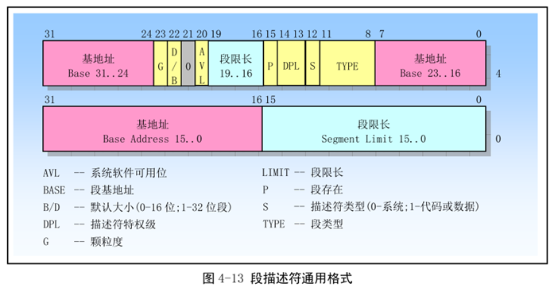

**示例中的文本转化成obj程序有错，自行编写txt2obj文件**

------

**gcc不要链接到标准头文件目录和标准链接库，自行链接到自己的库和头文件目录中**

------

**通过全局段号记录表GDT记录所有段的信息，通过GDTR来获取GDT的地址和有效设定个数**

**IDT中断记录表记录中断号与调用函数的关系**

**最后作者的os入口在0x28001b,因为前1a是作者编译的程序的头部信息，我用的不是他的工具，因此直接跳到0x280000**

------

### 段选择符

32位汇编中16位段寄存器(CS、DS、ES、SS、FS、GS)中不再存放段基址,而  是段描述符在段描述符表中的索引值,D3-D15位是索引值,D0-D1位是优先级(RPL)用于特权检查,D2位是描述符表引用指示位TI,TI=0指 示从全局描述表GDT中读取描述符，TI=1指示从局部描述符中LDT中读取描述符。这些信息总称段选择符(段选择子).

### 段描述符

描述符占8个字节，以下分别讲述每个字节存储的相关信息（从高地址开始）。

- | G    | 粒度位，                         | G位为0时，段界限以字节为单位，段的扩展范围1B~1MB; G位为1时，段界限以4KB为单位，段的扩展范围4KB~4GB. |
  | ---- | -------------------------------- | ------------------------------------------------------------ |
  | S    | 指定描述符的类型                 | S位为0时，表示系统段； S位为1时，表示代码段或数据段，栈段也是特殊的数据段。 |
  | DPL  | 特权级别                         | 共有4种处理器支持的特权级别，0，1，2，3； 0是最高级别，3是最低级别； 描述符的特权级用于指定访问该段所必须的最低特权级别，如果这里的数值为2，那么只有特权级别为0，1，2的程序才能访问该段，特权级别为3的程序访问该段时，将会被阻止。 |
  | P    | 段存在位                         | 1表示该段存在，0表示该段不存在                               |
  | D/B  | 默认的操作数大小                 | 0表示是16位的段，1表示是32位的段                             |
  | L    | 64位代码段标志                   | 保留此位留给64位处理器使用                                   |
  | TYPE | 指示描述符的子类型，或者说是类别 | 对于数据段，这4位分别是X，E，W，A； 对于代码段，这4位分别是X，C，R，A； |
  | AVL  | 软件可以使用的位                 | 操作系统来用，处理器并不使用它                               |

### GDTR全局描述符寄存器

48位，高32位存放GDT基址，低16为存放GDT限长。

### LDTR局部描述符寄存器

16位，高13为存放LDT在GET中的索引值。

IA-32处理器仍然使用xxxx：yyyyyyyy（段选择器：偏移量）逻辑方式表示一个线性地址，那么是怎么得到段的基址呢？在上面说明中我们知道，要得到段的基址首先通过段选择符xxxx中TI位指定的段描述符所在位置： 当 TI=0时表示段描述符在GDT中，如下图所示：

① 先从GDTR寄存器中获得GDT基址。

② 然后再GDT中以段选择符高13位位置索引值得到段描述符。

③ 段描述符符包含段的基址、限长、优先级等各种属性，这就得到了段的起始地址（基址），再以基址加上偏移地址yyyyyyyy才得到最后的线性地址。

当TI=1时表示段描述符在LDT中，如下图所示：

① 还是先从GDTR寄存器中获得GDT基址。

② 从LDTR寄存器中获取LDT所在段的位置索引(LDTR高13位)。

③ 以这个位置索引在GDT中得到LDT段描述符从而得到LDT段基址。

④ 用段选择符高13位位置索引值从LDT段中得到段描述符。

⑤ 段描述符符包含段的基址、限长、优先级等各种属性，这就得到了段的起始地址（基址），再以基址加上偏移地址yyyyyyyy才得到最后的线性地址。

