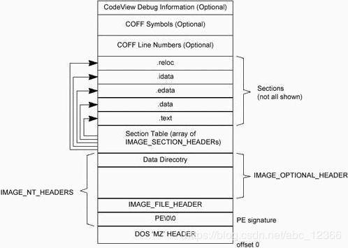
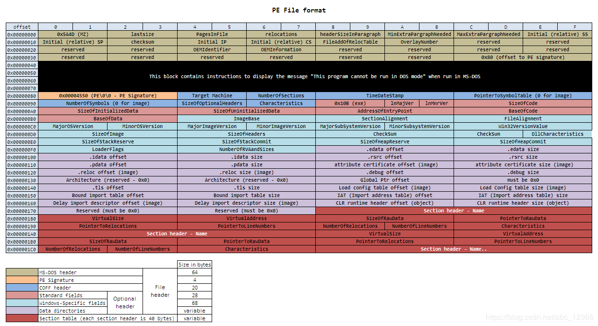
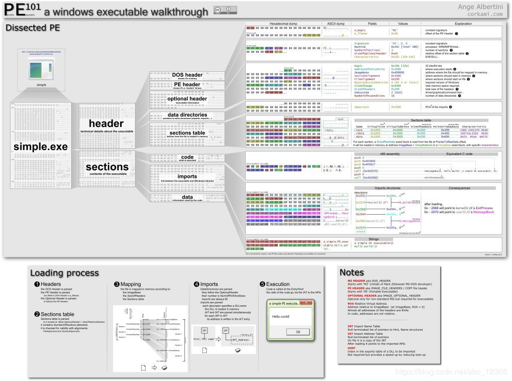
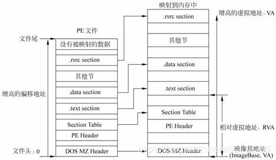
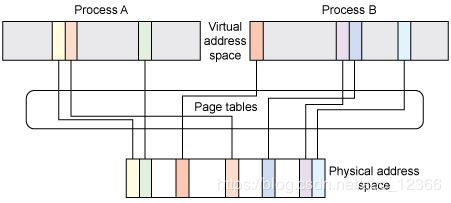

今天的第二个实验花了我较长时间去完成，主要是我之前把可执行文件都转化成去掉头部的bin文件来执行，这次作者用了他所编写的文件格式的头部来执行call和retf，而我恰好去掉了头部所以没有办法插入这几句代码，不过我很快就想到了出路，因为我并不是用了作者的工具了编译和链接的，而是直接用mingw的gcc，因此可执行文件是PE格式的，我看了几份关于PE结构的资料后，发现可以利用PE的头部来完成跳转。

#### 先看一下PE的资料

##### PE的简单结构图：


##### 复杂一点的：



所以我们只要在Section Table这块找到代码段的地址就能跳进代码段了。

##### 所以接下来看详细一点的头部：



代码段大多数是第一个段，也就是在0x18c这4个字节出写了代码段在文件中的地址。因此，我们只要在头部前的几个字节执行两句命令：

```assembly
CALL [CS:0X18C]
RETF
```

即可完成。

尝试了一下后顺利通过。

------

##### 关于PE的更详细的知识，再深入下去就得看书了









------

#### 关于最后一个实验的

最后一个实验确实有点难，我看了好一会的代码才看懂作者的意思。

```c
		if (finfo->size >= 8 && strncmp(p, "MZ", 2) == 0) {
			p[0] = 0x2e;
			p[1] = 0xff;
			p[2] = 0x15;
			p[3] = 0x8c;
			p[4] = 0x01;
			p[5] = 0x00;
			p[6] = 0x00;
			p[7] = 0xcb;
		}
		start_app(0, 1003 * 8, 64 * 1024, 1004 * 8, &(task->tss.esp0));
		memman_free_4k(memman, (int) p, finfo->size);
		memman_free_4k(memman, (int) q, 64 * 1024);
		cons_newline(cons);
		return 1;
	}
	return 0;
```

先说结论，在调用完start_app后确实是回到了下一行代码

```assembly
_start_app:		; void start_app(int eip, int cs, int esp, int ds, int *tss_esp0);
		PUSHAD		
		MOV		EAX,[ESP+36]	
		MOV		ECX,[ESP+40]	
		MOV		EDX,[ESP+44]	
		MOV		EBX,[ESP+48]	
		MOV		EBP,[ESP+52]	
		MOV		[EBP  ],ESP		
		MOV		[EBP+4],SS		
		MOV		ES,BX
		MOV		DS,BX
		MOV		FS,BX
		MOV		GS,BX
		
		OR		ECX,3		
		OR		EBX,3		
		PUSH	EBX			
		PUSH	EDX				
		PUSH	ECX				
		PUSH	EAX				
		RETF

```

在PUSHAD之前，栈里面最后一个数据就是调用start_app函数这行的下一行的IP值，然后PUSAD，再将此时的栈地址，即ESP和SS的值，写入[EBP]和[EBP+4]，也就是操作系统的tss的ESP段和SS段中。

```assembly
end_app:
		MOV		ESP,[EAX]
		POPAD
		RET	
```

因此，在end_app这里，将[EAX]的值移入ESP，也就是将操作系统的tss的保存的地址移入ESP，所以POPAD就会依次将tss中的内容写写入各个寄存器，此时同样把ESP和ES的值也改写了，所以POPAD后，栈地址又变成了刚跳转到_start_app时的栈地址，此时栈里面的数据就是调用start_app()函数的下一行代码的IP值，因此RET就能回到操作系统了。


今天的实验没踩到坑，不过难度确实比之前要难不少，希望接下来能加快速度了，明天多赶几天的进度。